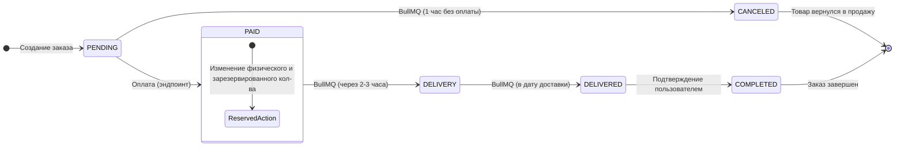

# Cybersite-2077

Read this in other languages:

- [English](./README_ENG.md)

## Project Description

**Примечание: проект находится на стадии разработки**

### Core Concept (Общий концепт)

---

Концептуально проект является E-commerce агрегатором (маркетплейс) с упором на максимальную безопасность данных и скорость работы.

### Architecture (Архитектура)

---

Проект построен по принципу Fullstack Monorepo с использованием архитектурной методологии FSD (Feature-Sliced Design) на фронтенде и Layered Architecture (слоистая архитектура) внутри модульного монолита на бэкенде. Взаимодействие клиентской и серверной частей приложения осуществляется по RESTful API. Для написания стилей на фронтенде используется подход CSS Modules.

- Использование Turborepo позволяет делить код на переиспользуемые пакеты: клиентское приложение, API-сервер, общую схему данных, единые схемы валидации, общие типы и т.п.
- Использование методологии FSD повышает масштабируемость кода, делает код предсказуемым и упрощает тестирование.
- Использование CSS Modules позволяет писать стили, для каждого компонента отдельно (компонентный подход), делая классы стилей для каждого компонента уникальными.
- Модульный монолит является способом горизонтального деления кода (по бизнес-логике), что позволяет легко вынести любой из них в отдельный микросервис в будущем, так как они не перемешаны друг с другом. Слоистая архитектура является способом вертикального деления внутри каждого модуля. В такой архитектуре все функции приложения находятся в одном кодовом пространстве и запускаются как единый процесс, но весь код строго разделен на независимые модули, которые общаются друг с другом через четко определенные API. Модульный монолит позволяет быстро писать код, подготавливая почву для последующего переезда на микросервисную архитектуру.

## Demo (Скриншоты)

## Release notes (Список изменений)

[Смотри файл CHANGELOG.md](./CHANGELOG.md)

## 🛠 Tech Stack (Технологический стек)

### Frontend

#### Frontend Core

- **React:** основная библиотека для создания UI-интерфейса всего приложения.
- **TypeSrcipt:** основной язык, используемый для строгой типизации кода.
- **Vite:** инструмент для сборки (бандлер)фронтенд-проектов, позволяющий объединять несколько файлов JS/TS/CSS в один, минифицировать код, произволить компиляцию файлов.
- **React Router:** библиотека для управления навигацией и маршрутами приложения.
- **Zustand:** клиентский стейт-менеджер для глобальных данных.
- **React Query:** серверный стейт-менеджер для работы с серверным состоянием: кеширование, пагинация и синхронизация данных с API.
- **Axios:** HTTP-клиент для запросов к серверу.

#### Forms & Validation

- **React-hook-form:** библиотека для управления состоянием форм.

#### Styles

- **Sass:** препроцессор стилей, расширяющий возможности обычного CSS в процессе написания кода.
- **PostCSS:** инструмент для преобразования CSS с помощью JS-плагинов, автоматизирующий рутинные задачи (автопрефиксер, минификация, поддержка новых стандартов). Он оптимизирует CSS-код, повышает его совместимость с различными браузерами и позволяет использовать функционал, которого в обычном CSS еще нет, превращая его в старый понятный любому браузеру.

#### Code Style & Tools

- **StyleLint:** линтер для CSS (и препроцессоров стилей), предназначенный для автоматической проверки кода на наличие ошибок, соблюдения стилевых соглашений и поддержания единообразия.

#### Testing & Quality

- **React-Testing-Library:** библиотека для тестирования (Unit и интеграционного) React-компонентов, позволяющая тестировать приложение так, как его видит пользователь, а не проверять внутренности кода.
- **Vitest:** фреймворк для модульного тестирования.
- **Cypress:** инструмент для E2E тестирования. Он запускает реальный браузер и имитирует действия живого пользователя, что позволяет проверить, что все части системы работают слаженно вместе.
- **Storybook:** инструмент для разработчки компонентов в изоляции от основного приложения. При работе со Storybook компоненты становятся автономными, проверяемыми и переиспользуемыми модулями.
- **Chromatic:** сервис для визуального регрессионного тестирования, который работает в связке со Storybook. Он делает скриншоты (скриншот-тестирование) компонентов и сравнивает их с предыдущими версиями.
- **React-error-boundary:** специальный компонент в React, который работает как блок try-catch, но для визуальной части приложения (UI). Он отлавливает ошибку в дочерних компонентах и вместо сломанного интерфейса показывает запасной вариант.

[Документация по тестированию](./TESTING_STRATEGY.md)

#### UI & Animation

- **React Hot Toast:** библиотека для создания всплывающих уведомлений (toast-сообщений) в React-приложениях.

#### Different

- **ч:**
- **ч:**
- **ч:**

---

### Backend

#### Core Runtime

- **Express.js:** фреймворк для Node.js, превращающий его в полноценный веб-сервер. Позволяет работать с маршрутизацией, использовать middlewares, работать с HTTP-методами и пр.
- **TypeSrcipt:** основной язык, используемый для строгой типизации кода.

#### Database & Storage

- **PostgreSQL:** реляционная СУБД.
- **Prisma ORM:** инструмент, предназначенный для взаимодействия с реляционными базами данных.
- **PostGIS:** расширение для PostgreSQL, которое превращает её в полноценную геоинформационную систему (ГИС).
- **MongoDB:** нереляционная СУБД документного типа.
- **Mongoose:** библиотека (ODM) для работы с MongoDB в среде Node.js.
- **Redis:** сверхбыстрая NoSQL СУБД, хранящая данные в оперативной памяти по принципу «ключ-значение».

#### Search & Background Jobs

- **Elasticsearch:** высокопроизводительный аналитический движок для полнотекстового поиска, осуществления сортировки и фильтрации результатов.
- **BullMQ:** менеджер очередей на базе Redis для фоновых задач и синхронизации данных с Elasticsearch.

#### Monitoring & Observability

- **Prometheus:** система для сбора и хранения числовых метрик приложения.
- **Grafana Loki:** система агрегации и хранения логов.
- **Grafana Tempo:** система для распределенной трассировки запросов, предназначенная для хранения и анализа трасс (путей запросов).
- **Grafana:** единая панель для визуализации метрик, логов и трейсов.

---

### Globals

#### Code Style & Tools

- **ESLint:** инструмент для статического анализа кода (линтер), который находит ошибки и следит за соблюдением единого стиля кода.
- **Prettier:** инструмент для автоматического форматирования кода (форматтер), который приводит весь код проекта к единому стилю.

#### Validation

- **Zod:** библиотека для валидации данных (синхронизирует типы TS и правила валидации). В проекте используется как на клиенте, так и на сервере.

#### Api Documentation

- **Swagger:** набор инструментов для проектирования, документирования, тестирования и развертывания RESTful API, работающий на базе спецификации OpenAPI.

---

### DevOps & Infrastructure

- **Turborepo:** высокопроизводительная система сборки для управления монорепозиторием.
- **Docker:** контейнеризация приложения для локальной разработки и деплоя. Позволяет упаковать код со всеми его зависимости в изолированный контейнер.
- **Nginx:** высокопроизводительный веб-сервер и Reverse Proxy.
- **Ansible:** управление конфигурациями и автоматизация деплоя на серверы.
- **Git:** распределенная система управления версиями, позволяющая работать с историей изменений.

## Features (Функционал)

### Global

**Security (Безопасность):**

- Безопасность обеспечивается использованием на сервере пакетов cors (настройка механизма CORS) , helmet (набор middleware, защищающий от распространенных угроз, таких как XSS, кликджекинг и перехват MIME-типов), hpp (защита от атак типа «загрязнение параметров HTTP»), dompurify (санитайзинг входящих данных).

---

### Identity Module

**Включает следующие функции:**

- Регистрация в приложении (встроенная и через OAuth + OIDC);
- Подтверждение аккаунта по почте.
- Логин в свой аккаунт.
- Управление данными в личном кабинете (аватар, персональные данные, смена пароля).
- Выход из аккаунта (в т.ч. из всех сессий).
- Удаление аккаунта.
- Двухфакторная аутентификация для пользователей с особыми полномочиями.
- Восстановление пароля.

**Подробности реализации:**

- Для хранения данных профиля пользователя используется PostgreSQL, что вызвано требованиями к безопасности и целостности данных.
- Подтверждение аккаунта по email при регистрации (генерация токенов активации и отправка писем через SMTP).
- Интеграция IMask для корректного ввода телефона и даты с автоматической типизацией.
- Все входные данные как на клиенте, так и на сервере проверяются при помощи **Zod** в строгом режиме, исключая лишние поля, что обеспечивает защиту от _Mass Assignment_. Основная проблема с Mass Assignment заключается в чрезмерном доверии пользовательскому вводу, в связи с чем злоумышленник может добавить в HTTP-запрос скрытые параметры.
- При вводе некорректных данных в формах модуля (логин, регистрация, восстановление пароля, редактирование профиля) происходит валидация в реальном времени и вывод пользователю ошибок ввода.
- Настроен автоматический редирект при работе с формами.
- При регистрации, логине, смене пароля через Forgot Password используется **Google reCaptcha v3**, чем обеспечивается невидимая для пользователя (не нужно вручную ничего вводить) защита от ботов и скриптов на всех публичных формах.
- Функционал восстановления пароля по email.
- Для имитации работы реального приложения добавлены в минималистичном виде "Согласие на обработку персональных данных" и "Политика конфиденциальности".
- Пароль на сервере хранится в хэшированном виде. Для хэширования используется **argon2**.
- В формах с вводом пароля используется подход _Password Visibility Toggle_, считающийся стандартом UX.
- В форме логина доступна _Persistent Authentication_ (постоянная аутентификация), что повышает удобство пользователя при частом использовании приложения, а также повышает безопасность, если пользователь должен зайти в аккаунт без сохранения следов авторизации.
- Аутентификация двумя способами: 1) Access Token (сохранение в памяти у клиента; проверка при помощи цифровой подписи) и Refresh Token (сохранение в HttpOnly Cookie у клиента и в БД на сервере; проверка при помощи цифровой подписи и записи в БД); 2) OAuth 2.0 + OIDC (авторизация через Google с автоматическим созданием профиля и подтягиванием аватара).
- Двухфакторная аутентификация (2FA) с использованием TOTP для пользователей с ролью ADMIN и SUPERADMIN. 2FA включается в личном кабинете пользователя.
- Автоматическое удаление неподтвержденного аккаунта через неделю после регистрации.
- Пользователь может иметь более одной сессии, что позволяет пользоваться приложением с нескольких устройств одновременно.
- В личном кабинете доступен выход как с текущей сессии, так и со всех сразу.
- В личном кабинете доступно удаление аккаунта.
- В личном кабинете доступно редактирование персональных данных.
- В личном кабинете реализована возможность загрузки своего аватара. Загруженный аватар удаляется при загрузке нового или же при удалении аккаунта.
- В личном кабинете доступна смена пароля.
- Для борьбы с гонкой токенов (race conditions) используется библиотека **axios-auth-refresh**. То есть, если одновременно на сервер ушло несколько запросов и все они получили 401, библиотека гарантирует, что функция обновления токена будет вызвана только один раз.
- Для ограничения количества запросов с одного IP используется Rate Limiting.

---

### Catalog Module

**Функционал и подробности реализации:**

- Для хранения данных каталога используется PostgreSQL, что позволяет эффективно управлять сложными структурами товаров, их атрибутами и связями.
- Переход в полный каталог через кнопку в Header.
- Просмотр предварительного каталога через кнопку в Header.
- Поиск моделей через поисковый инпут в Header.
- Каталог включает страницы категорий (реализована категория мотоциклов), страницы брендов (518 брендов), страницы конкретных брендов и страницы конкретных моделей мотоциклов.
- Для вывода брендов и моделей мотоциклов используется пагинация.
- Поиск: глобальный поиск в Header по всем моделям (с выводом подходящих вариантов и возможностью перехода на страницу с наиболее подходящими результатами); поиск на странице брендов (по брендам); поиск на странице бренда (по моделям).
- Фильтрация: реализована на странице бренда. Позволяет фильтровать по цене, объему двигателя, году выпуска, мощности, категории мотоцикла, типу привода и наличию товара.
- Товар, находящийся в наличии, помечен при помощи badge.
- Сортировка: реализована на странице бренда. Позволяет сортировать выводимые модели мотоциклов по алфавиту (возрастание / убывание), по цене (возрастание / убывание), по новизне (убывание) и по рейтингу (убывание.)
- Страница бренда позволяет выводить результаты (модели мотоциклов) в виде табличек и в виде списка.
- Вывод рекомендаций: на странице конкретной модели также выводится 4 аналогичные модели.
- На странице документации можно получить информацию о технических характеристиках конкретной модели, а также описание, условия гарантии и документацию на модель (всё, кроме технических характеристик, унифицировано).
- Для удобства навигации по каталогу реализованы хлебные крошки (breadcrumbs).
- Каталог наполнен записями мотоциклов (около 34k позиций) на основе датасета https://app.gigasheet.com/spreadsheet/motorcycle-data/42c25563_d896_4234_9074_36ce6c5caeca. Рейтинг, цена и доступные цвета для каждой модели сгенерированы скриптом рандомным образом.
- Для функционала поиска, сортировки и фильтрации используется движок Elasticsearch.
- Реализовано сохранение фильтров, поисковых запросов и состояния в целом при переходе между страницами каталога.

---

### Trading Module

**Функционал и подробности реализации:**

- Для хранения товаров в избранном выбран PostgreSQL, а для товаров корзины - Redis, что обусловлено его способностью обрабатывать временные данные с экстремально высокой скоростью, что критично для UX и снижения нагрузки на основные базы данных. Для просмотра данных в Redis подключен Redis Insight.
- Возможность добавления в избранное реализована для каждой отдельной карточки продукта (как в режиме grid, так и в режиме list), для страницы конкретного товара и для страницы корзины.
- Возможность добавления в корзину реализована для каждой отдельной карточки продукта (как в режиме grid, так и в режиме list), для страницы конкретного товара и для страницы избранного.
- Кнопка добавления в корзину при нажатии превращается в кнопки выбора количества товара и отображения его текущего количества в корзине. Нажатие на "-" при текущем количестве "1" удаляет товар из корзины.
- На странице избранного реализована логика "Показать ещё" для большого количества товаров.
- На странице корзины можно удалить из корзины как конкретный товар, так и все выбранные (добавлен чекбокс выбора всех товаров).
- На странице корзины отображается цена индивидуального товара, сумма по конкретной позиции с учётом её количества, общее количество выбранного товара и общая сумма заказа.
- В Header отображается текущее количество товаров, добавленных в избранное и в корзину. Нажатие на иконку перенаправляет на соответствующую старницу.
- Для удобства пользователя в контексте работы с избранным и корзиной реализована стратегия Optimistic UI - изменение товара в корзине и избранных товаров происходит мгновенно на стороне клиента с отменой при необходимости (если сервер не отработал или отказал в операции). Для этого используется Zustand + React Query.

---

### Warehouse Module

**Функционал и подробности реализации:**

- Для реализации модуля в PostgreSQL созданы таблицы складов и остатков на складах. Таблица складов заполнена данными о 5 складах в различных географических точках в пределах территории РФ. В таблице Stock в БД для каждой позиции товара и для каждого из пяти складов указаны остатки (остатки заполнены скриптом рандомно).
- При создании заказа пользователь должен указать свой адрес - для этого в приложение со стороны фронтенда внедрена географическая карта при помощи leaflet.js, а на бэкенде работает PostGIS (как единый docker-образ с PostgreSQL). Выбранная пользователем точка на карте трансформируется в текстовый адрес при помощи Nomenatim (поисковая система, предназначенная для геокодирования и обратного геокодирования данных). Координаты выбранной точки отправляются на сервер, где на их основе определяется ближайший склад (с учетом кривизны Земли) со всеми необходимыми товарами. Расстояние от точки доставки до склада ложится в основу расчета стоимости доставки (километраж) и даты доставки (выбран 1 день на 1000 км). Данные о доставке отображаются пользователю при создании заказа, а также влияют как на стоимость заказа, так и на изменение статуса заказа (подробнее про статусы описано в модуле Ordering).
- На географической карте при заказе можно выбрать любую точку в пределах РФ. Текущая выбранная точка, а также расположение всех складов отображаются метками. Если пользователь делает не первый заказ, то географические настройки последнего заказа используются для формирования дефолтного адреса по умолчанию (отображается последняя метка на карте, а также на его основе производятся базовые расчеты доставки).
- Для синхронизации (PostgreSQL и поискового движка) остатков на различных этапах заказа (при создании заказа происходит резервирование остатков, при оплате - списание, при отмене - возврат) запускается точечное обновление Elasticsearch.
- При добавлении в корзину срабатывает ограничение, которое не позволяет добавить товара больше, чем есть на остатках. На странице корзины при превышении остатков (товар добавили, когда он был на складе, а хотим сделать заказ, когда уже нет) блокируется кнопка создания заказа и выводится предупреждение о необходимости изменения количества товара.

---

### Ordering Module

**Функционал и подробности реализации:**

- Для реализации модуля в PostgreSQL созданы таблицы заказов и товаров в заказе.
- На страницу создания заказа не пускает, если профиль пользователя не заполнен, или если число товара в корзине превышает реальное количество остатков на складах.
- Реализована система управления жизненным циклом заказов на базе BullMQ. Это позволяет выносить тяжелые или отложенные во времени операции в фоновые процессы, не блокируя основной поток API. Жизненный цикл следующий (статусы заказов): pending (ожидает оплаты), cancelled (отменен), paid (ждет отправки), delivery (отправлен), delivered (ждет получения), completed (завершен). После создания заказ переходит в статус pending. В этом статусе заказ ожидает оплаты в течение 1 ч. Если за это время оплата не произошла, то происходит автоматическое удаление заказа и тот переходит в статус cancelled. После оплаты статус меняется на paid. После этого через 2-3 ч (рандомно) происходит смена статуса на delivery - после этого уже нельзя вручную отменить заказ со страницы заказов. В день рассчитанной доставки статус меняется на delivered, после чего на странице заказов появляется кнопка для подтверждения заказа, после нажатия которой происходит смена статуса на completed и появляется кнопка, позволяющая оставить отзыв. Отслеживание и изменение статусов заказа происходит при помощи BullMQ.

- В Header добавлена иконка-ссылка на страницу заказа. Над иконкой отображатся счетчик активных заказов (статус pending, paid, delivery). Счетчик обнуляется сразу при логауте, а актуальные данные подтягиваются сразу после логина.
- На странице заказов отображается информация по каждому заказу - номер, дата, сумма, статус, данные по товару, указанный адрес доставки. Реализована фильтрация по статусу заказа.
- Для синхронизации выбранных товаров в корзине и на странице оформления заказа реализовано сохранение состояния о selected в Redis.
---

### Review Module

**Функционал и подробности реализации:**

- Для реализации хранения данных отзывов выбрана MongoDB в связи с тем, что отзывы — это неструктурированные данные и внедрение последующего функционала (древовилные ответы, сложные метаданные и т.п.) будет проще реализовать на NoSQL-БД, к тому же в проекте используется гибридная архитектура хранения данных, подразумевающая вынос пользовательского контента в отдельную БД. Взаимодействие с MongoDB осуществляется через ODM Mongoose.
- После перехода заказа в статус COMPLETED пользователю открывается кнопка "Оставить отзыв". Нажатие на кнопку открывает модальное окно, в котором можно выставить рейтинг (1-5), написать комментарий и загрузить изображения (до 5 шт). Оставить отзыв можно индивидуально для каждой позиции заказа (только один раз на каждый товар в заказе). Оставление отзыва приводит к изменению рейтинга.
- Просмотр отзывов реализован на странице каждого мотоцикла во вкладке "Отзывы" (компонента Tab). Там же можно удалить любой отзыв - удаление доступно как автору комментария, так и любому пользователю с ролью ADMIN. 
- Удаление отзыва приводит к изменению рейтинга, очистке БД и удалению фотографий отзыва с сервера.
- Текст комментария, введенные пользователем, на сервере проходит санитайзинг перед сохранением в БД с целью избежания атак на клиентов при отображении отзывов. Текст ввода также ограничен (по обеим границам) с выводом подсказок пользователю.
- Изображения отзывов на странице товара открываются в виде галереи, что позволяет просматривать их в широком формате и переключаться между изображениями при помощи клавиатуры.

---

### Discount Module

**Функционал и подробности реализации:**

- Модуль реализует фунционал скидок (глобальных и индивидуальных) и промокодов. 
- Промокоды: раз в неделю генерируется 5 случайных слов (при помощи библиотеки faker), выступающих в роли промокода. Каждый промокод даёт скидку от 100000 до 200000 руб к цене товара. Пользователь может использовать все доступные промокоды, но не более одного раза каждый. Ввод промокода осуществляется на странице корзины.
- Глобальные скидки: раз в 24 часа выбирается случайный год среди годов производства продаваемых мотоциклов. В течение этого дня на все мотоциклы выбранного года производства пользователь получает скидку 5-15 % (рандомно генерируется). На главной странице висит баннер, указывающий на что действует глобальная скидка в текущий момент и сколько она ещё будет действовать.
- Индивидуальные скидки: раз в день происходит выбор рандомного мотоцикла (для каждого зарегистированного и подтвержденного аккаунта) среди всего ассортимента и на этот мотоцикл пользователь получает фиксированную скидку в 20%. Индивидуальная скидка активна в течение недели. После генерации индивидуальной скидки пользователю по email посылается письмо с указанием стоимости товара (до и после скидки), наименования продукции и ссылки на товар.
- Приоритеты: если товар подходит и под индивидуальную и глобальную скидку, то применяется та, которая даёт наибольшую выгоду покупателю (скидка действует только на товар, а не на доставку). Промокод применяется после применения скидки в самом конце расчёта цены товара.
- Генерация промокодов (раз в неделю), индивидуальных и глобальных скидок (раз в день) осуществляется при помощи BullMQ.
- Актуальная цена с учетом скидок (а также badge на карточках товара) реализована во всех местах сайта, отображающих цену товара (страница бренда с карточками мотоциклов, страница поиска с карточками мотоциклов, страница конкретного мотоцикла, страница избранных товаров, страница корзины). Для получения актуальных данных реализовано обогащение информацией о скидках данных, получаемых на клиенте из Elasticsearch. Не авторизованный пользователь получает информацию только о глобальных скидках, а авторизованный ещё и о индивидуальных.

---

### Payment Module

**Функционал и подробности реализации:**

- Оплатить заказ можно как при его создании, так и впоследствии (за счёт записи реквизитов в БД заказа) в течение 1 часа (после этого заказ автоматически отменяется). При нажатии на кнопку оплаты появляется pre-payment модальное окно.
- В качестве платежного агрегатора выбрана ЮKassa (используется тестовый магазин). Коннект осуществляется через ngrok. Платежи происходят на стороне ЮKassa. Используются одноэтапные (без холдирования) платежи. Номера рабочих (тестовых) карт для оплаты выводятся в pre-payment модальном окне.
- Для фильтрации сторонних запросов на эндпоинт приема ответа от Юкассы установлен IP-фильтр. 
- При отмене заказа после оплаты происходит запрос к Юкассе и возврат средств. 
- Оплата заказа производит изменение его статуса с PENDING на PAID, а также происходит конечное списание остатков (quantity уменьшается, reserved обнуляется) на складах.

---

### Notifications Module

**Функционал и подробности реализации:**

- Для того, чтобы владелец магазина мог получать актуальную информацию о созданных, оплаченных и доставленных заказах, а также о сгенерированных скидках/промокодах и оставленных отзывах, данные пересылаются в ТГ-бот.
- Оповещения в приложении построены на Event-Driven архитектуре (EDA) - различные сервисы (producers) генерируют события, а централизованный слушатель (consumer) реагирует на них - посылает сообщения в ТГ-бота и на электронные почты пользователей.
- Сообщения на электронную почту пользователей посылаются при следующих событиях: регистрация нового аккаунта, попытка восстановления пароля, генерация персональных скидок, завершена доставка заказа. 
- Сообщения в ТГ-бота посылаются при следующих событиях: создание нового заказа, оплата заказа, завершена доставка заказа, сгенерированы промокоды и скидки общей командой генерации, оставлен отзыв на товар.
---

### Support Module

**Функционал и подробности реализации:**

- Реализована форма фидбека, позволяющая задать любой вопрос. Форма доступна как авторизованным, так и не авторизованным пользователям (последним ограничена загрузка файлов).
- К форме можно прикрепить изображения, а также файлы формата txt, pdf, doc/docx.
- Форма проходит валидацию (Zod) как на клиенте, так и сервере.
- Отправка формы защищена от спама через Google reCAPTCHA v3.
- Загруженные файлы хранятся на сервере и автоматически удаляются через 30 дней после закрытия тикета (CLOSED или RESOLVED) при помощи BullMQ. 
- Статус заданных вопросов пользователь может отслеживать через личный кабинет.

## ⚙️ Getting Started (Запуск проекта)

## Authors & License (Авторы и Лицензия)
