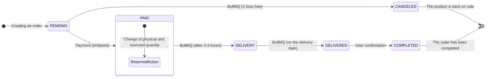
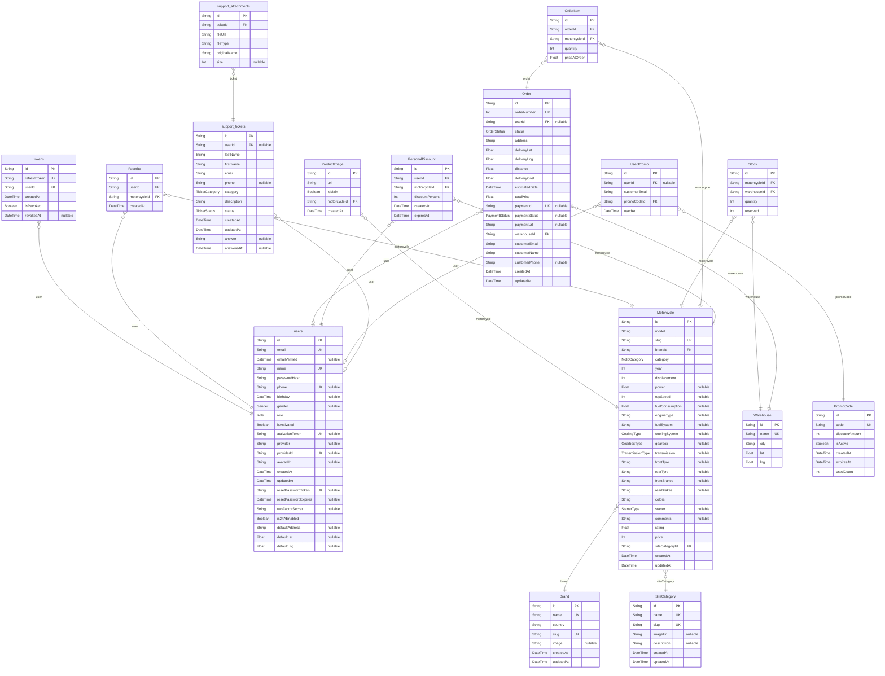

# Cybersite-2077


[](LICENSE)

#### Frontend


#### Backend


#### Testing


#### Tooling


#### DevOps


Read this in other languages:

- [Russian](./assets/README_RUS.md)

## Project Description

### Core Concept

Conceptually, the current pet project is the company's e-commerce platform (a website for remote product sales/branded online store). The entire application design was developed from scratch, and the front-end and back-end code were written. All code runs in Docker containers, and a CI process is configured.
Structurally, the project consists of the following modules: Identity (authentication, authorization, user profile), Catalog (catalog; main product - motorcycles: 518 brands, 35k+ positions), Trading (favorites, cart), Ordering (order processing), Warehouse (product balances, working with a geomap), Payment (integration with ЮKassa), Discount (discounts and promo codes), Notifications (notifications in TG), Reviews (product reviews), Support (functionality for contacting support from users), Content (publishing news on the site), Reports (generation of reports on key business metrics), Admin (custom admin panel for working with data in the database (brands, product nomenclature, balances, users), manual generation of reports, discounts, content, working with support tickets and order management). The implemented functionality almost completely corresponds to the functionality of production projects, with the exception of some points for which stubs were written (delivery; payment is implemented only through the ЮKassa test account).

### Architecture

The project is built on the Fullstack Monorepo principle, using the FSD (Feature-Sliced ​​Design) architectural methodology on the frontend and Layered Architecture within a modular monolith on the backend. Interaction between the client and server components of the application is accomplished via a RESTful API. CSS Modules is used for frontend styling.

- Using Turborepo allows you to divide your code into reusable packages: client application, API server, common data schema, unified validation schemes, common types, etc.
- Using the FSD methodology increases code scalability, makes code predictable, and simplifies testing.
- Using CSS Modules allows you to write styles for each component separately (component-based approach), making the style classes for each component unique.
- A modular monolith is a method of horizontally dividing code (based on business logic), making it easy to move any of them into a separate microservice in the future, as they are not mixed with each other. A layered architecture is a method of vertically dividing each module. In this architecture, all application functions are located in a single codespace and run as a single process, but all code is strictly divided into independent modules that communicate with each other through clearly defined entry points. A modular monolith allows for rapid code writing, paving the way for a subsequent transition to a microservice architecture.

### Project Structure

```
cybersite2077/
├── apps/                            # Frontend && Backend
│   ├── server/                      # Backend
│   │   ├── src/
│   │   │   ├── modules/
│   │   │   │   ├── admin/           # The logic of the admin panel
│   │   │   │   ├── catalog/         # Logic of working with the catalog
│   │   │   │   ├── content/         # Logic of working with content
│   │   │   │   ├── discount/        # The logic of discounts and promo codes
│   │   │   │   ├── identity/
│   │   │   │   │   ├── auth/        # Authentication/authorization logic
│   │   │   │   │   └── profile/     # Logic for updating profile data
│   │   │   │   ├── notifications/   # Notification logic in Telegram
│   │   │   │   ├── ordering/        # Order formation logic
│   │   │   │   ├── payment/         # Order payment logic
│   │   │   │   ├── reports/         # Logic of report generation
│   │   │   │   ├── reviews/         # The logic of working with reviews
│   │   │   │   ├── support/         # The logic of technical support work
│   │   │   │   ├── trading/         # Logic for working with favorites/basket
│   │   │   │   └── warehouse/       # The logic of working with balances and delivery
│   │   │   ├── sripts/              # Scripts executed when building containers
│   │   │   ├── shared/              # Shared backend logic
│   │   │   │   ├── lib/             # Connecting the Event Bus/Mongoose/Redis
│   │   │   │   │   ├── eventBus.ts  # Setting up a general event bus
│   │   │   │   │   ├── logger.ts    # Setting up the Loki logger
│   │   │   │   │   ├── mongoose.ts  # Setting up Mongoose
│   │   │   │   │   ├── multer.ts    # Setting up Multer
│   │   │   │   │   ├── redis.ts     # Setting up Redis
│   │   │   │   │   └── tracing.ts   # Setting up Tempo
│   │   │   │   ├── middlewares/     # Backend middleware
│   │   │   │   ├── services/        # Service for reCAPTCHA v3
│   │   │   │   └── utils/           # General utilities
│   │   │   ├── app.ts               # Connecting all middleware and routes
│   │   │   └── index.ts             # Launching the DB, server, and other services
│   │   └── uploads/                 # Files for display on the frontend
│   ├── web/                         # Frontend
│   │   ├── .storybook/              # Setting up Storybook
│   │   ├── cypress/                 # E2E-tests
│   │   ├── public/                  # Public files
│   │   ├── src/
│   │   │    ├── app/
│   │   │    │   ├── provides/       # Frontend routing
│   │   │    │   ├── styles/         # Global styles
│   │   │    │   ├── ui/             # Global wrapper component
│   │   │    │   └── App.tsx         # The main component of the frontend
│   │   │    ├── entities/           # Front-end business entities
│   │   │    ├── features/           # Front-end business logic
│   │   │    ├── pages/              # All pages
│   │   │    ├── shared/             # Shared files
│   │   │    │   ├── api/            # Interacting with the server
│   │   │    │   ├── assets/         # General images/icons/fonts
│   │   │    │   ├── lib/            # Auxiliary components
│   │   │    │   └── ui/             # Reusable simple components
│   │   │    ├── widgets/            # Independent components
│   │   │    └── main.tsx            # Main frontend TSX file
│   │   └── index.html               # Main frontend HTML file
|── deploy/                          # Configs for deployment
│   ├── loki/                        # Config for Grafana Loki
│   ├── nginx/                       # Config for Nginx
│   ├── prometheus/                  # Config for Prometheus
│   ├── prometheus/                  # Config for Grafana Tempo
│   ├── docker-compose.prod.yml      # Launching containers for production
│   └── docker-compose.yml           # Launching containers for development
|── packages/                        # Shared project modules
│   ├── database/                    # Setting up a connection to PostgreSQL (Prisma)
│   ├── openapi/                     # Project API Description
│   ├── types/                       # Shared types
│   └── validation/                  # Zod validation schemes
|── CHANGELOG.md                     # Project change log
|── TESTING_STRATEGY.md              # Strategy for manual/automated testing
└── README.md                        # Project description

```

## Demo
Watch the latest demo on YouTube:

[](https://www.youtube.com/watch?v=7y4Q71LkbKo&t=326s)
[The complete project video demo (download)](https://media.githubusercontent.com/media/ValeriyTm/Cybersite-2077/media/ProjectDemo.mp4)

Preview (somewhat outdated):


## Release notes

[Open CHANGELOG](./CHANGELOG.md)

## 🛠 Tech Stack

### 1.Frontend

#### 1.1.Frontend Core

- **React:** the main library for creating the UI interface of the entire application.
- **TypeSrcipt:** the primary language used to strongly type code.
- **Vite:** a tool for assembling (bundler) front-end projects that allows you to combine several JS/TS/CSS files into one, minify the code, and compile files.
- **React Router:** a library for managing application navigation and routes.
- **Zustand:** a client state manager for global data.
- **React Query:** a server state manager for working with server state: caching, pagination, and data synchronization with the API.
- **Axios:** HTTP client for making requests to the server.

#### 1.2.Forms & Validation

- **React-hook-form:** library for managing form state.

#### 1.3.Styles

- **Sass:** a stylesheet preprocessor that extends the capabilities of regular CSS as you write it.
- **PostCSS:** a tool for transforming CSS using JS plugins, automating routine tasks (autoprefixing, minification, and support for new standards). It optimizes CSS code, improves its compatibility across browsers, and enables the use of features not yet found in standard CSS, transforming it into a legacy CSS that is native to any browser.

#### 1.4.Code Style & Tools

- **StyleLint:** a linter for CSS (and stylesheet preprocessors) designed to automatically check code for errors, enforce style conventions, and maintain consistency.

#### 1.5.Testing & Quality

- **React-Testing-Library:** a library for testing (unit and integration) React components, allowing you to test the application as the user sees it, rather than checking the internals of the code.
- **Vitest:** unit testing framework.
- **Cypress:** an end-to-end testing tool. It runs a real browser and simulates the actions of a live user, allowing you to verify that all parts of the system are working together smoothly.
- **Storybook:** a tool for developing components in isolation from the main application. When working with Storybook, components become standalone, testable, and reusable modules.
- **Chromatic:** a visual regression testing service that works in conjunction with Storybook. It takes screenshots (screenshot testing) of components and compares them with previous versions.
- **React-error-boundary:** a special component in React that works like a try-catch block, but for the visual part of the application (UI). It catches errors in child components and displays a fallback version instead of the broken interface.

[Testing documentation](./TESTING_STRATEGY.md)

#### 1.6.UI & Animation

- **React Hot Toast:** a library for creating pop-up notifications (toast messages) in React applications.
- **Motion:** a library for creating animations and interactive gestures in React applications.
- **IMask:** a library for creating input masks in HTML elements.
- **TanStack Table:** a headless UI library for managing the state and logic of complex tables and data grids in web applications.
- **Leaflet.js:** a lightweight library for creating interactive mobile maps.
- **Swiper.js:** a library for creating sliders, touch carousels, and mobile swipe interfaces.
- **Tanstack Tables:** a headless library for creating and managing complex tables and data grids.

### 2.Backend

#### 2.1.Core Runtime

- **Express.js:** a framework for Node.js that turns it into a full-fledged web server. It allows you to work with routing, use middleware, work with HTTP methods, and more.
- **TypeSrcipt:** the primary language used for strong code typing.

#### 2.2.Database & Storage

- PostgreSQL: A relational DBMS.
- Prisma ORM: A tool designed for interacting with relational databases.
- PostGIS: An extension for PostgreSQL that turns it into a full-fledged geographic information system (GIS).
- MongoDB: A non-relational document-based DBMS.
- Mongoose: A library (ODM) for working with MongoDB in a Node.js environment.
- Redis: An ultra-fast NoSQL DBMS that stores data in memory using the key-value principle. The project uses Redis to manage the cart state and as a message broker for the BullMQ library (generating reports and discounts, sending emails, changing order statuses, etc.), which allows heavy operations to be moved out of the main Node.js thread, preventing server blocking.
- ioredis: A Redis client library for solving complex problems in high-load systems.
- Multer: A library used for processing form data in the multipart/form-data format. It is the standard tool for uploading files to the server in Express-based applications.
- Sharp: A library for image processing, primarily focused on converting, resizing, and optimizing images.

#### 2.3. Search & Background Jobs

- **Elasticsearch:** a high-performance analytics engine for full-text search, sorting, and filtering.
- **BullMQ:** a Node.js library that implements message queues based on Redis for background tasks (heavy and delayed jobs).

#### 2.4. Monitoring & Observability

- **Prometheus:** a system for collecting and storing application metrics (CPU/RAM, HTTP requests, database connections).
- **Morgan:** middleware for collecting logs from HTTP requests.
- **Winston:** a universal logging system for the entire application.
- **Grafana Loki:** a log aggregation and storage system.
- **Grafana Tempo:** a distributed request tracing system designed for storing and analyzing traces (request paths).
- **Grafana:** a unified dashboard for visualizing metrics, logs, and traces.
- **Yandex Metrica:** a web analytics service for tracking traffic, analyzing user behavior, and evaluating advertising effectiveness.
- **Sentry:** a platform for monitoring errors and performance in the frontend of an application. Sentry intercepts crashes, exceptions, and critical issues in real time, providing precise context: call stack, environment, and user actions.

### 3.Globals

#### 3.1.Code Style & Tools

- **ESLint:** a static code analysis tool (linter) that finds errors and enforces a consistent code style.
- **Prettier:** an automatic code formatter that ensures a consistent style for all project code.

#### 3.2.Validation

- **Zod:** a data validation library (synchronizes TS types and validation rules). The project uses it on both the client and server.

#### 3.3.Api Documentation

- **Swagger:** a set of tools for designing, documenting, testing, and deploying RESTful APIs based on the OpenAPI specification.

### 4. DevOps & Infrastructure

- **Turborepo:** a high-performance build system for managing a monorepo.
- **Docker:** application containerization for local development and deployment. Allows you to package code and all its dependencies in an isolated container.
- **Nginx:** a high-performance web server and reverse proxy.
- **Git:** a distributed version control system that allows you to work with change history. Also used is GitHub Actions, GitHub's built-in platform for automated development processes (CI/CD), which allows you to automatically build, test, and deploy code.

## Features

### 1. Global

**1.1. Security:**

- Security is ensured by the use of the following packages on the server: cors (configuring the CORS mechanism), helmet (a set of middleware that protects against common threats such as XSS, clickjacking (headers "X-Frame-Options: DENY" and "Content-Security-Policy: frame-ancestors 'none'"), and MIME type interception), hpp (protection against HTTP parameter pollution attacks), and dompurify (sanitization of incoming data to protect against XSS).
- User data is validated using Zod on both the client (upon input) and the server (all routes). The length (min/max) of user input is limited, and regular expressions are used.
- ESLint is integrated with OWASP Top 10 search plugins: SonarJS (helps find complex logic holes that could become hacking holes) and No-Unsanitized (to prevent XSS (DOM injection) attacks) are used on the frontend code; SonarJS and Security (useful for finding dangerous regular expressions (protecting against ReDoS attacks) and searching for vulnerabilities in Node.js, for example, detect-child-process, detect-non-literal-require) are used on the backend code.
- Authentication in the application is implemented as follows: the access token is stored in the application's memory (not in localStorage), and the refresh token is stored in a cookie. - Cookies are marked httpOnly: true, which blocks access to them via document.cookie, preventing session theft during XSS. The SameSite attribute is also set for cookies in the Set-Cookie HTTP response header to prevent CSRF attacks. To avoid sending cookies from the client to the server with every request, the path parameter is configured—cookies are sent only to the Auth module endpoints.
- To combat brute-force and DoS attacks, all public user requests are rate-limited (for public forms, the limit is reduced compared to general requests).
- The application does not contain any functionality that works with XML, so XXE attacks are not a threat.
- Search inputs are equipped with debounce functionality, which reduces the server load, protecting against DoS attacks.
- To protect against XSSI (given the access token handling scheme used), tokens are returned to the client only in JSON format, only the POST method is used to refresh the access token, and the origin header is checked on the server side (via CORS).
- The proven, modern argon2 library is used for password hashing, and the jwt library is used for generating and verifying access tokens.
- SQL injection protection is provided by the Prisma ORM (which uses parameterized queries under the hood) for server-to-database interaction. - Retrieving, adding, updating, or deleting a resource is performed using the appropriate HTTP method (RESTful API), i.e., GET requests are not used to change server state.
- Server-side logging of requests is implemented.
- Unauthorized users and users with inappropriate permissions cannot access protected pages. This is implemented on the frontend by redirecting unauthorized users from protected paths and visually hiding them, and on the server side by checking through the required middleware. When logging out, the account state is immediately updated, so a new user logging in to the application after the user with the same browser will not be able to see the previous user's data. To prevent the browser from caching sensitive data, middleware is implemented on the server, setting response headers that prohibit the browser from caching protected pages.
- OWASP Dependency-Check is connected to the CI, which scans all project dependencies (including transitive ones) for known vulnerabilities.

**1.2.UI/UX:**

- Responsive Design: To ensure the correct visual display of the app on devices with various screen sizes, the app is adapted for use on screens up to 360px, using a graceful degradation strategy. The following breakpoints are used: 1600px, 1441px, 1200px, 1024px, 768px, and 481px. The included postcss-pxtorem PostCSS plugin converts px to rem, and a custom function is used to smoothly change the text font size (based on clamp) across the entire range of screen sizes, which together leads to increased responsiveness of the interface on the user's device. To improve responsiveness, the (min)/(max)-width(height) properties are also used, along with font and image sizes adjusted based on screen size using custom mixins. To combat click sticking on mobile devices, a custom mixin was also written for the hover effect.
- Favicons: The project uses favicons in the following formats: svg, ico (48x48 - to support older versions of IE), and png (to support all major browsers and various devices - 16x16, 32x32, 36x36, 48x48, 70x70, 96x96, 120x120, 144x144, 150x150, 180x180, 192x192, 310x310, 512x512). Icons are enabled in HTML (for use by browsers on all devices for display in the browser tab, history, and bookmarks), in the web manifest (for use by Android (Chrome) and desktop Chrome/Edge for PWA mode), and in browserconfig (for use by Windows 8/10/11 and IE for design, for example, in the Start menu).
- Performance: To reduce client load and speed up page loading, the lazy:loading and decoding:async attributes have been applied to numerous image types. To optimize image handling, all images uploaded by users to the server are processed by the sharp package, which compresses and converts them to lightweight webp.
- Themes: Instead of the standard "light theme/dark theme" combination, the application now features four switchable themes. Changing themes changes the primary colors, logos, and other decorative elements (cursor, visual inserts).
- For ease of use with forms, complex fields (date, phone number) are implemented using the IMask library.
- Order cancellation functionality, the ability to leave a review, support forms, display of the current order status, promo codes, discount campaigns (including email notifications about new special offers), profile editing (name and avatar selection), display of recommendations based on the currently viewed product, the ability to add products to favorites, etc. Improve customer experience and user experience. The implemented functionality for the application administrator to add various content can increase customer retention on the site.
- When developing the design, the main principles of UI/UX were taken into account: a limited palette of colors with correct contrast and compatibility with each other was used for each theme; pure black is not used - its shades were chosen; the number of fonts is limited, all symbols of the selected fonts are easily readable; large blocks of text are not used to improve readability; page elements are placed freely; responsive design allows you to control negative space; all elements that should attract attention are visually highlighted with colors, borders and backlighting; potentially dangerous actions (cancel, delete) are highlighted in red; all information necessary for the user is not deeply hidden, but is immediately presented in plain sight; many UI components of the application were based on UI components from various popular modern web applications; to hide unnecessary information when displaying modal windows, the background is blurred and darkened; to improve the readability of the text, a barely noticeable outline was added in places where the background interrupts the visual text; The entire project is designed in a unified style, including the custom admin panel, all site cards (catalog, products, orders, etc.), and the external design; to standardize the UI, dedicated UI components are reused in the layout; loaders are implemented throughout to ensure a sense of content loading speed; if an error occurs, the user is notified of its occurrence with a clear, customized message for each specific error; validation is enabled when working with forms, notifying the user of incorrectly entered data and providing tips on how to resolve the error; all actions useful for business (adding to favorites, adding to cart, placing an order, paying for an order) are performed by the user very simply in a few steps, and the UI elements necessary for these actions are always visible to the user in various parts of the application; For all major functions that require long-term interaction with the server, saving changes first to the local state, and then updating the state with the server one, is an example of applying the Optimistic UI approach, which corresponds, among other things, to the Doherty threshold concept, according to which the response time, i.e. the speed of process execution, should be considered an important functional property of the design that underlies good UX; all interfaces are sufficiently simplified in terms of the complexity of working with them, however, Tesler's law is not violated anywhere (interfaces will not be simplified to the point of losing their meaning); to smooth out negative peaks in user mood caused by the occurrence of some error (application error, page 404), error handling is implemented in the project and in all critical cases the user is shown aesthetically pleasing pages with explanations of what is happening; to handle text input with errors in search fields according to Postel's law, the Elasticsearch search engine is connected, which finds results even if they do not perfectly match the input; All input fields, selectors, and inputs contain appropriate textual notes on the purpose of their components; in accordance with Fitts's law, touch targets are conveniently located and large enough to allow for precise, confident touching; the app's interface, in the context of its entire global functionality, complies with Jacob's law—all key functions (ordering, catalog management, payment, etc.) are implemented similarly to websites the customer has previously used.

**1.3.Miscellaneous:**

- SEO: A pet project is a typical SPA application, so achieving the required level of search engine optimization is very difficult. However, the project has taken steps to improve SEO—the methods used for this purpose will be described below. Human-readable URLs are used on all application pages, all characters are in Latin, words are separated only by hyphens, and unnecessary words are avoided to keep the address as short as possible. The markup of all components is valid and semantic. The necessary HTML page meta tags are specified. The Open Graph micro-markup protocol is used. Canonical links and titles are added to the site pages by implementing the react-helmet-async library (used for dynamically managing the contents of the head section in React applications). To save crawl budget and protect certain pages, indexing of admin panel pages, as well as personalized pages (profile, authorization, etc.) via the robots meta tag and the robots.txt file, is prohibited. A dynamic route mapped in robots.txt is used to generate sitemap.xml. JSON-LD microdata is used on product pages. The Lighthouse SEO score is 90-100.
- Accessibility: the project supports semantic layout principles (h1-h6 hierarchy, use of specialized tags; no incorrect use of element roles); keyboard navigation is implemented on the pages; interactive elements visually respond to hover, focus, etc. states; all input / textarea / select elements have an associated label; error output with tooltips and notifications for resolving them is implemented on input elements; all images have alt attributes. All clickable elements have an interaction size of at least 44x44px (in accordance with WCAG); animation can be disabled in the app (both native animation and animation from the Motion library) with the appropriate user settings; aria attributes (aria-role, aria-label, aria-hidden, etc.) are implemented where necessary; when entering data into filters, parameters are set in the address bar; standard methods of interacting with interactive elements are provided; the Lighthouse accessibility score is 85-100 (most commonly 90-100).
- API: Module endpoints are described according to the OpenAPI standard.

### 2. Identity Module

**Includes the following features:**

- In-app registration (integrated and via OAuth + OIDC);
- Account verification via email.
- Account login.
- Personal account data management (avatar, personal information, password change).
- Account logout (including all sessions).
- Account deletion.
- Two-factor authentication for users with special permissions.
- Password recovery.

**Implementation details:**

- PostgreSQL is used to store user profile data due to security and data integrity requirements.
- Account confirmation via email upon registration (activation token generation and sending emails via SMTP).
- IMask integration for correct phone number and date entry with automatic typing.
- All input data on both the client and server is validated using Zod in strict mode, excluding unnecessary fields, providing protection against Mass Assignment. The main problem with Mass Assignment is its overreliance on user input, which allows an attacker to add hidden parameters to the HTTP request.
- When entering incorrect data in the module forms (login, registration, password recovery, profile editing), validation occurs in real time and input errors are displayed to the user.
- Automatic redirection is configured when working with forms. - When registering, logging in, and changing your password through Forgot Password, Google reCaptcha v3 is used, providing invisible protection against bots and scripts on all public forms (no manual entry required).
- Password recovery via email.
- To simulate a real application, a minimalist "Consent to the Processing of Personal Data" and "Privacy Policy" have been added.
- The password is stored on the server in hashed form. Argon2 is used for hashing.
- Password entry forms use the _Password Visibility Toggle_ approach, considered a UX standard.
- Persistent Authentication is available in the login form, improving user experience for frequent app users and enhancing security if the user needs to log in without leaving a trace of their authorization.
- Two authentication methods: 1) Access Token (stored in the client's memory; verified using a digital signature) and Refresh Token (stored in an HttpOnly Cookie on the client and in the server's database; verified using a digital signature and a database entry); 2) OAuth 2.0 + OIDC (authorization via Google with automatic profile creation and avatar selection).
- Two-factor authentication (2FA) using TOTP for users with the ADMIN and SUPERADMIN roles. 2FA is enabled in the user's personal account.
- Automatic deletion of unconfirmed accounts one week after registration.
- Users can have more than one session, allowing them to use the app from multiple devices simultaneously.
- In your personal account, you can log out of the current session or log out of all sessions at once.
- You can delete your account in your personal account. Deleting an account will delete the associated user ID in all possible tables (orders, support tickets, promo code usage (critical data will remain in these tables)), and records about favorite products, personal discounts, and authorization tokens will also be completely deleted.
- You can edit your personal data in your personal account.
- You can upload your own avatar in your personal account. The uploaded avatar is deleted when you upload a new one or when you delete your account.
- You can change your password in your personal account.
- The **axios-auth-refresh** library is used to combat token race conditions. This means that if multiple requests are sent to the server simultaneously and all receive a 401 response, the library ensures that the token refresh function is called only once. To protect against race conditions, a grace period is implemented on the server side: when rotating tokens, the old token is not physically deleted immediately, but is marked as revoked with a time stamp. If a parallel duplicate request with the same token arrives within a short window (4 seconds), the backend "forgives" this micro-race, gracefully rejecting the duplicate but keeping the user's session active. This allows the session to remain active if multiple requests arrive with very little time difference. Revoked tokens are periodically removed from the database by a BullMQ-based worker. - If an attacker intercepts an old Refresh token and attempts to send it to the server, the backend will detect the reuse attempt (Token Reuse Detection). The system will immediately consider this a session compromise and automatically invalidate all active sessions for that user in the database, forcibly logging them out of all devices.
- Rate Limiting is used to limit the number of requests from a single IP address.

### 3.Catalog Module

**Functionality and implementation details:**

- PostgreSQL is used to store catalog data, allowing for efficient management of complex product structures, their attributes, and relationships.
- Access to the full catalog via a button in the Header.
- View a preliminary catalog via a button in the Header.
- Search for models via the search input in the Header.
- The catalog includes category pages (a motorcycle category is implemented), brand pages (518 brands), pages for specific brands, and pages for specific motorcycle models.
- Pagination is used to display motorcycle brands and models.
- Search: global search in the Header across all models (displaying matching options and the ability to navigate to the page with the most relevant results); search on the brand page (by brand); search on the brand page (by model).
- Filtering: implemented on the brand page. Allows filtering by price, engine displacement, year of manufacture, power, motorcycle category, drive type, and product availability. - In-stock items are marked with a badge.
- Sorting: implemented on the brand page. Allows you to sort the displayed motorcycle models alphabetically (ascending/descending), by price (ascending/descending), by newness (descending), and by rating (descending).
- The brand page allows you to display results (motorcycle models) in both table and list formats.
- Recommendation display: the page for a specific model also displays four similar models.
- The documentation page provides information on the technical specifications of a specific model, as well as a description, warranty terms, and documentation (everything except technical specifications is standardized).
- Breadcrumbs have been implemented for easy catalog navigation.
- The catalog is filled with motorcycle records (approximately 34k items) based on the dataset https://app.gigasheet.com/spreadsheet/motorcycle-data/42c25563_d896_4234_9074_36ce6c5caeca. The rating, price, and available colors for each model are randomly generated by a script.
- The Elasticsearch engine is used for searching, sorting, and filtering.
- Filters, search queries, and the overall state are saved when switching between catalog pages.

### 4.Trading Module

**Functionality and implementation details:**

- PostgreSQL was selected for storing favorites, and Redis for cart items. This is due to its ability to process temporary data at extremely high speed, which is critical for UX and reducing the load on the main databases. Redis Insight is integrated for viewing data in Redis.
- The ability to add to favorites is implemented for each individual product card (in both grid and list modes), for the specific product page, and for the cart page.
- The ability to add to cart is implemented for each individual product card (in both grid and list modes), for the specific product page, and for the favorites page.
- When clicked, the Add to Cart button transforms into buttons for selecting the quantity of the item and displaying the current quantity in the cart. Clicking "-" when the current quantity is 1 removes the item from the cart.
- The Favorites page now has a "Show more" logic for a large number of items. - On the cart page, you can delete a specific item or all selected items from the cart (a checkbox has been added for selecting all items).
- The cart page displays the price of an individual item, the total for a specific item including its quantity, the total quantity of the selected item, and the total order amount.
- The Header displays the current number of items added to Favorites and the cart. Clicking on the icon redirects to the corresponding page.
- For user convenience, the Optimistic UI strategy has been implemented for working with Favorites and the cart: changes to cart items and Favorites are made instantly on the client side, with cancellation if necessary (if the server has failed or rejected the operation). This is achieved using Zustand + React Query.

### 5.Warehouse Module

**Functionality and implementation details:**

- To implement the module, warehouse and inventory tables were created in PostgreSQL. The warehouse table is populated with data for five warehouses in various locations across the Russian Federation. The "Stock" table in the database displays the inventory for each product item and for each of the five warehouses (the inventory is randomly populated by a script).
- When placing an order, the user must specify their address. For this purpose, a geographic map is embedded in the frontend of the application using leaflet.js, and PostGIS runs on the backend (as a single Docker image with PostgreSQL). The user-selected point on the map is transformed into a text address using Nomenatim (a search engine designed for geocoding and reverse geocoding data). The coordinates of the selected point are sent to the server, where they are used to determine the nearest warehouse (taking into account the curvature of the Earth) with all the required products. The distance from the delivery point to the warehouse is used to calculate the delivery cost (mileage) and delivery date (1 day per 1000 km is selected). Delivery data is displayed to the user when creating an order and affects both the order cost and changes to the order status (more information about statuses is available in the Ordering module).
- When placing an order, you can select any location within the Russian Federation on the geographic map. The currently selected location, as well as the locations of all warehouses, are displayed as markers. If this is not the user's first order, the geographic settings of the last order are used to generate the default address (the last marker is displayed on the map, and basic delivery calculations are based on it).
- To synchronize (PostgreSQL and the search engine) the balances at various order stages (when creating an order, the balances are reserved, upon payment, they are written off, and upon cancellation, they are refunded), a targeted Elasticsearch update is triggered.
- When adding to cart, a limit is triggered that prevents adding more items than are in stock. On the shopping cart page, if the balance is exceeded (the item was added when it was in stock, but we want to place an order when it is no longer available), the button for creating an order is blocked and a warning is displayed about the need to change the quantity of the item.

### 6.Ordering Module

**Functionality and implementation details:**

- To implement the module, tables for orders and products in the order have been created in PostgreSQL.
- The order creation page is blocked if the user's profile is incomplete or if the number of items in the cart exceeds the actual inventory level.
- An order lifecycle management system has been implemented using BullMQ. This allows heavy or delayed operations to be moved to background processes without blocking the main API thread. The order lifecycle statuses are as follows: pending (awaiting payment), canceled, paid (awaiting shipment), delivery (shipped), delivered (awaiting receipt), completed. After creation, an order is assigned the pending status. In this status, the order awaits payment for 1 hour. If payment is not made within this time, the order is automatically deleted and the status is changed to canceled. After payment, the status changes to paid. After this, the order status changes to delivery after 2-3 hours (randomly). After this, the order can no longer be manually canceled from the orders page. On the estimated delivery day, the status changes to delivered, after which a button for confirming the order appears on the orders page. Clicking this changes the status to completed, and a button allowing you to leave a review appears. Order statuses are tracked and updated using BullMQ.


```mermaid
stateDiagram-v2

 direction LR
    [*] --> PENDING : Creating an order
    PENDING --> CANCELED : BullMQ (1 hour free)
    PENDING --> PAID : Payment (endpoint)

    state PAID {
        [*] --> ReservedAction : Change of physical and reserved quantity
    }

    PAID --> DELIVERY : BullMQ (after 2-3 hours)
    DELIVERY --> DELIVERED : BullMQ (on the delivery date)
    DELIVERED --> COMPLETED : User confirmation

    CANCELED --> [*] : The product is back on sale
    COMPLETED --> [*] : The order has been completed
```

- An icon linking to the order page has been added to the Header. A counter for active orders (status pending, paid, delivery) is displayed above the icon. The counter is reset immediately upon logout, and current data is retrieved immediately after logging in.
- The Orders page displays information for each order: number, date, amount, status, product details, and specified delivery address. Filtering by order status has been implemented.
- To synchronize selected items in the cart and on the checkout page, the "selected" state is now stored in Redis.

### 7.Review Module

**Functionality and implementation details:**

- MongoDB was chosen to store review data because reviews are unstructured data, and implementing subsequent functionality (tree responses, complex metadata, etc.) would be easier with a NoSQL database. Furthermore, the project uses a hybrid data storage architecture, which means storing user content in a separate database. Interaction with MongoDB is accomplished via ODM Mongoose.
- After an order reaches the COMPLETED status, the user sees the "Leave a review" button. Clicking the button opens a modal window where they can set a rating (1-5), write a comment, and upload up to 5 images. Reviews can be left individually for each item in the order (only once per item). Leaving a review changes the rating.
- Reviews can be viewed on each motorcycle page in the "Reviews" tab (Tab component). You can also delete any review there—deletion is available to both the comment author and any user with the ADMIN role.

- Deleting a review changes the rating, clears the database, and removes review photos from the server.
- Comment text entered by the user is sanitized on the server before being saved to the database to prevent attacks on clients when displaying reviews. Input text is also limited (at both boundaries) with user prompts.
- Review images on the product page open as a gallery, allowing you to view them in full-screen format and navigate between images using the keyboard.

### 8.Discount Module

**Functionality and implementation details:**

- The module implements discounts (global and individual) and promo codes.

- Promo codes: Once a week, 5 random words are generated (using the faker library), which act as promo codes. Each promo code provides a discount of 100,000 to 200,000 rubles on the price of the product. The user can use all available promo codes, but no more than once each. Promo codes are entered on the cart page.
- Global discounts: Once every 24 hours, a random year is selected from among the production years of motorcycles for sale. During this day, the user receives a 5-15% discount (randomly generated) on all motorcycles of the selected production year. A banner on the main page indicates what the global discount is currently valid for and how long it will remain valid. - Individual discounts: Once a day, a random motorcycle is selected from the entire inventory (for each registered and verified account) and the user receives a fixed 20% discount on this motorcycle. The individual discount is active for one week. After the individual discount is generated, the user receives an email indicating the product price (before and after the discount), the product name, and a link to the product.
- Priorities: If an item qualifies for both an individual and global discount, the one that provides the greatest benefit to the buyer is applied (the discount applies only to the item, not to shipping). The promo code is applied after the discount is applied, at the very end of the product price calculation.
- Promo codes (once a week) and individual and global discounts (once a day) are generated using BullMQ.
- The current price, including discounts (as well as the badge on product cards), is now available in all areas of the website where the product price is displayed (brand page with motorcycle cards, search page with motorcycle cards, specific motorcycle page, featured products page, and cart page). To ensure up-to-date data, the data retrieved from Elasticsearch on the client is enriched with discount information. An unauthorized user receives information only about global discounts, while an authorized user also receives information about individual discounts.

### 9.Payment Module

**Functionality and implementation details:**

- You can pay for an order either upon creation or later (by saving the details to the order database) within 1 hour (after which, the order is automatically canceled). Clicking the payment button opens a pre-payment modal window.
- ЮKassa is selected as the payment aggregator (a test store is used). Connection is via ngrok. Payments are processed on the ЮKassa side. Single-stage payments (without holding) are used. The numbers of working (test) cards for payment are displayed in the pre-payment modal window.
- An IP filter is installed on the ЮKassa response endpoint to filter third-party requests.
- If an order is canceled after payment, a request is made to ЮKassa and the funds are refunded.
- Payment for the order changes its status from PENDING to PAID, and the final write-off of the remaining balances (quantity is reduced, reserved is reset) in the warehouses occurs.
- For security reasons, when receiving a response from ЮKassa, a response request to the official IP address with the received ID has been implemented to ensure the validity of the data before the application's business logic is executed.
  -Changes in the order payment status are accompanied by the generation of events with subsequent notification in the Telegram channel.

  ### 10.Notifications Module

**Functionality and implementation details:**

- To ensure that store owners receive up-to-date information about created, paid, and delivered orders, as well as generated discounts/promo codes and reviews, the data is sent to the Telegram bot.
- Notifications in the application are built on an Event-Driven Architecture (EDA) - various services (producers) generate events, and a centralized listener (consumer) responds to them by sending messages to the Telegram bot and to users' email addresses.
- Messages are sent to users' email addresses upon the following events: new account registration, password recovery attempt, personal discount generation, and order delivery completion.
- Messages are sent to the Telegram bot upon the following events: new order creation, order payment, order delivery completion, promo codes and discounts generated by the general generation command, and product reviews left.

### 11.Support Module

**Functionality and implementation details:**

- A feedback form has been implemented, allowing you to ask any question. The form is available to both authorized and unauthorized users (unauthorized users are limited to file uploads).
- You can attach images, as well as .txt, .pdf, and .doc/.docx files to the form.
- The form is validated (Zod) on both the client and server.
- Form submission is protected from spam using Google reCAPTCHA v3.
- Uploaded files are stored on the server and are automatically deleted 30 days after the ticket is closed (CLOSED or RESOLVED) using BullMQ.
- The user can track the status of their questions in their personal account.

### 12.Reports Module

**Functionality and implementation details:**

- The Reports service collects statistics via Prisma – it calculates total revenue, the number of paid orders, and identifies the top 5 best-selling motorcycle models. It also identifies items whose stock levels have become critical (one or fewer units). Reports are generated based on all this information.
- Reports are generated in both PDF and xlsx (Excel) formats. The ExcelJS library is used to create multi-page tables, and Puppeteer is used to convert HTML templates to PDF.
- Automation is implemented via BullMQ (Cron) – every morning, a TG bot sends a short text digest, and every Monday, it generates and sends full files (Excel + PDF) for the week. - Commands have been written for the TG bot that allow you to instantly receive current statistics (in PDF only or in both formats) directly in the messenger.

### 13.Admin Module

**Functionality and implementation details:**

- A custom admin panel has been written, including sections for: catalog management (brands, products, warehouse balances), orders, user inquiries, discounts and promo codes, app content management (news), reports, and access management. The data management sections support basic CRUD operations.
- All admin panel sections are restricted both visually (on the frontend) and by server authorization in accordance with the RBAC (Role-Based Access Control) access control model.

- Access permissions matrix (RBAC) for the admin panel:

| Category        | Section                     |  CONTENT_EDITOR  |          MANAGER          |           ADMIN           | SUPERADMIN                |
| :-------------- | :-------------------------- | :--------------: | :-----------------------: | :-----------------------: | ------------------------- |
| **Catalog**     | Brands                      |        ❌        |    View, change, spec.    |    View, change, spec.    | View, change, spec.       |
|                 | Motorcycles                 |       View       |    View, change, spec.    |    View, change, spec.    | View, change, spec.       |
|                 | Warehouses and availability |        ❌        | View, change. qty., spec. | View, change. qty., spec. | View, change. qty., spec. |
| **Orders**      | All orders                  |        ❌        |           View            |   View, change. status    | View, change. Status      |
| **Support**     | Support Tickets             |        ❌        | View, Reply, Edit Status  | View, Reply, Edit Status  | View, Reply, Edit Status  |
| **Marketing**   | Discounts                   |        ❌        |           View            |      View, Generate       | View, Generate            |
|                 | Reports                     |        ❌        |         Generate          |         Generate          | Generate                  |
| **Maintenance** | Maintenance                 |        ❌        |            ❌             |        Start Sync         | Start Sync                |
| **Content**     | News                        | Create, Edit, ID |            ❌             |     Create, Edit, ID      | Create, Edit, ID          |
| **Access**      | Users                       |        ❌        |            ❌             |            ❌             | View, Edit Roles, ID      |

- Pagination and filtering/searching are now implemented in section tabs that require working with large amounts of information.
- Editing catalog data in the admin panel synchronizes the data with Elasticsearch, allowing you to receive up-to-date data immediately after editing.

### 14.Content Module

**Functionality and implementation details:**

- News items are created using the corresponding section of the admin panel, which offers a custom designer that allows you to upload images, write text, and specify motorcycle IDs (which are used to pull up product cards with images, current prices, specifications, etc.) in various combinations.
- MongoDB + Mongoose is used to store created news items. This database was chosen due to the chaotic structure of the generated information, which is facilitated by the use of a custom designer.
- News items created by users with the appropriate roles have statuses, allowing them to be written without immediate publication. Published news items are available in the corresponding tab of the application (in the Header component).
- Standard CRUD operations can be performed on news items, allowing for updating the information.

## Database Architecture

The system is built on PostgreSQL using Prisma ORM. The architecture is divided into independent modules. PostgreSQL is used for transactional data and PostGIS for geolocation.


```mermaid
erDiagram
"users" {
  String id PK
  String email UK
  DateTime emailVerified "nullable"
  String name UK
  String passwordHash
  String phone UK "nullable"
  DateTime birthday "nullable"
  Gender gender "nullable"
  Role role
  Boolean isActivated
  String activationToken UK "nullable"
  String provider "nullable"
  String providerId UK "nullable"
  String avatarUrl "nullable"
  DateTime createdAt
  DateTime updatedAt
  String resetPasswordToken UK "nullable"
  DateTime resetPasswordExpires "nullable"
  String twoFactorSecret "nullable"
  Boolean is2FAEnabled
  String defaultAddress "nullable"
  Float defaultLat "nullable"
  Float defaultLng "nullable"
}
"tokens" {
  String id PK
  String refreshToken UK
  String userId FK
  DateTime createdAt
  Boolean isRevoked
  DateTime revokedAt "nullable"
}
"Brand" {
  String id PK
  String name UK
  String country
  String slug UK
  String image "nullable"
  DateTime createdAt
  DateTime updatedAt
}
"Motorcycle" {
  String id PK
  String model
  String slug UK
  String brandId FK
  MotoCategory category
  Int year
  Int displacement
  Float power "nullable"
  Int topSpeed "nullable"
  Float fuelConsumption "nullable"
  String engineType "nullable"
  String fuelSystem "nullable"
  CoolingType coolingSystem "nullable"
  GearboxType gearbox "nullable"
  TransmissionType transmission "nullable"
  String frontTyre "nullable"
  String rearTyre "nullable"
  String frontBrakes "nullable"
  String rearBrakes "nullable"
  String colors
  StarterType starter "nullable"
  String comments "nullable"
  Float rating
  Int price
  String siteCategoryId FK
  DateTime createdAt
  DateTime updatedAt
}
"SiteCategory" {
  String id PK
  String name UK
  String slug UK
  String imageUrl "nullable"
  String description "nullable"
  DateTime createdAt
  DateTime updatedAt
}
"ProductImage" {
  String id PK
  String url
  Boolean isMain
  String motorcycleId FK
  DateTime createdAt
}
"Favorite" {
  String id PK
  String userId FK
  String motorcycleId FK
  DateTime createdAt
}
"Warehouse" {
  String id PK
  String name UK
  String city
  Float lat
  Float lng
}
"Stock" {
  String id PK
  String motorcycleId FK
  String warehouseId FK
  Int quantity
  Int reserved
}
"Order" {
  String id PK
  Int orderNumber UK
  String userId FK "nullable"
  OrderStatus status
  String address
  Float deliveryLat
  Float deliveryLng
  Float distance
  Float deliveryCost
  DateTime estimatedDate
  Float totalPrice
  String paymentId UK "nullable"
  PaymentStatus paymentStatus "nullable"
  String paymentUrl "nullable"
  String warehouseId FK
  String customerEmail
  String customerName
  String customerPhone "nullable"
  DateTime createdAt
  DateTime updatedAt
}
"OrderItem" {
  String id PK
  String orderId FK
  String motorcycleId FK
  Int quantity
  Float priceAtOrder
}
"PersonalDiscount" {
  String id PK
  String userId FK
  String motorcycleId FK
  Int discountPercent
  DateTime createdAt
  DateTime expiresAt
}
"PromoCode" {
  String id PK
  String code UK
  Int discountAmount
  Boolean isActive
  DateTime createdAt
  DateTime expiresAt
  Int usedCount
}
"UsedPromo" {
  String id PK
  String userId FK "nullable"
  String customerEmail
  String promoCodeId FK
  DateTime usedAt
}
"support_tickets" {
  String id PK
  String userId FK "nullable"
  String lastName
  String firstName
  String email
  String phone "nullable"
  TicketCategory category
  String description
  TicketStatus status
  DateTime createdAt
  DateTime updatedAt
  String answer "nullable"
  DateTime answeredAt "nullable"
}
"support_attachments" {
  String id PK
  String ticketId FK
  String fileUrl
  String fileType
  String originalName
  Int size "nullable"
}
"tokens" }o--|| "users" : user
"Motorcycle" }o--|| "Brand" : brand
"Motorcycle" }o--|| "SiteCategory" : siteCategory
"ProductImage" }o--|| "Motorcycle" : motorcycle
"Favorite" }o--|| "users" : user
"Favorite" }o--|| "Motorcycle" : motorcycle
"Stock" }o--|| "Motorcycle" : motorcycle
"Stock" }o--|| "Warehouse" : warehouse
"Order" }o--o| "users" : user
"Order" }o--|| "Warehouse" : warehouse
"OrderItem" }o--|| "Order" : order
"OrderItem" }o--|| "Motorcycle" : motorcycle
"PersonalDiscount" }o--|| "users" : user
"PersonalDiscount" }o--|| "Motorcycle" : motorcycle
"UsedPromo" }o--o| "users" : user
"UsedPromo" }o--|| "PromoCode" : promoCode
"support_tickets" }o--o| "users" : user
"support_attachments" }o--|| "support_tickets" : ticket
```

### Identity Module

- User: Central table. Supports RBAC (5 roles), OAuth (Google), 2FA, and stores user geographic coordinates (PostGIS) for default shipping calculations.
- Token: Refresh token storage for managing active sessions.

### Catalog Module

- Brand: Brands linked to countries and logos.
- Motorcycle: Main model with 20+ technical parameters (engine, transmission, tires, cooling type).
- SiteCategory: Global categories for website navigation.
- ProductImage: Image gallery (with the main photo marked as "Main").

### Trading Module

- Favorite: List of products linked to users who have marked this product as "favorite."

### Warehouse Module

- Warehouse: Warehouses with precise coordinates for working with maps.
- Stock: Balance table. Implements double-debit logic: quantity (physical inventory) and reserved (reserved for unpaid orders).

### Ordering Module

- Order: Financial order document. Records the delivery cost according to the rate, distance, payment status (ЮKassa), and estimated arrival date.
- OrderItem: Order contents - items, quantity, and price at the time of purchase.

### Discount Module

- PersonalDiscount: Personalized offers (20%) on specific models with a limited validity period (3 days).
- PromoCode: Global promo codes for a fixed amount.
- UsedPromo: Code usage log to prevent duplicate use by the same user.

### Support Module

- SupportTicket: Ticket system. Supports anonymous requests and requests from authorized users.
- SupportAttachment: Storage of file attachment metadata (logs, images).

## ⚙️ Getting Started

### Getting Started

1. Clone the repository to your local machine:

```bash
git clone https://github.com/ValeriyTm/Cybersite-2077.git
```

2. From the root of the cloned project, install all dependencies:

```bash
npm install
```

3. Create .env files in the frontend apps/web folder and in the root folder based on the .env.sample files in the corresponding directories. If the .env files are not completely filled in, the application will not work correctly or will not launch at all.

4. Build the frontend from the project root:

```bash
npm run build -w web
```

5. Launch containers. From the project root, run:

```bash
docker compose -f deploy/docker-compose.yml up -d --build
```

Launching the server container (and therefore the entire application) will take some time (seeding the database, synchronizing with Elasticsearch, and running other scripts). You can tell that the application has started functioning by looking at the logs inside the server container – a message indicating successful server startup should appear.

6. You need to configure ngrok, otherwise the payment functionality will not work in the application.

- Register at https://dashboard.ngrok.com/signup
- Create ngrok.yml (a sample is located in assets/ngrok-example.yml), specifying your token and domain with ngrok.
- The ngrok.yml file should be located in the standard location: C:\Users\<User>\AppData\Local\ngrok\ngrok.yml (Windows), ~/.config/ngrok/ngrok.yml (macOS), or ~/Library/Application Support/ngrok/ngrok.yml (Linux).
- To launch ngrok, run the command:

```bash
ngrok start --all
```

7. After all these steps, the application will be running on http://localhost. The database will already be populated, and you can log in to the application using the default admin account (login - admin@cybersite2077.com, password - AdminPassword2077!).

8. For convenient work with databases, containers with Adminer (for PostgreSQL), Mongo-Express (for MongoDB), and Redis-Insight (for Redis) are also launched.

- Adminer - http://localhost:8085. Select the PostgreSQL engine, server "postgres," login "admin," password "password," and database "cybersite_db."
- Mongo-Express - http://localhost:8081/. Login - "dev," password - "dev."
- Redis-Insight - http://localhost:5540/. Specify redis://default@cybersite_redis:6379 in the connection.

You can monitor data from Loki, Prometheus, and Tempo using Grafana - http://localhost:3050. Go to your domain, then --> Connections --> Data Sources --> Add New Data Source --> Select Tempo / Loki / Prometheus. When setting up the URL, enter http://tempo:3200 / http://loki:3100 / http://prometheus:9090. Click Save & Test, then Exlpore View.

P.S. For active development, you should increase the rate limiting limits in apps/server/src/shared/middlewares/rate-limiter.ts.

### Launching in Production

1. The .env.prod file in the project root must be correctly populated based on .env.prod.sample.

2. For proper SEO, specify your actual frontend domain in apps/web/pulic/robots.txt.

3. The following code blocks should be commented out (there are hints in the comments):

- Import tracing.js in apps/server/src/index.ts.
- Redirect to Grafana and Tempo in deploy/nginx/nginx.conf.

4. From the project root, run:

```bash
docker compose -p cybersite-prod -f deploy/docker-compose.prod.yml up -d --build
```

P.S. Don't forget to correct your real domain for the following services: Google reCAPTCHA, Google OAuth, ЮKassa, Yandex Metrika, otherwise they won't work with your application.

## Authors & License

- [MIT License](./LICENSE)
