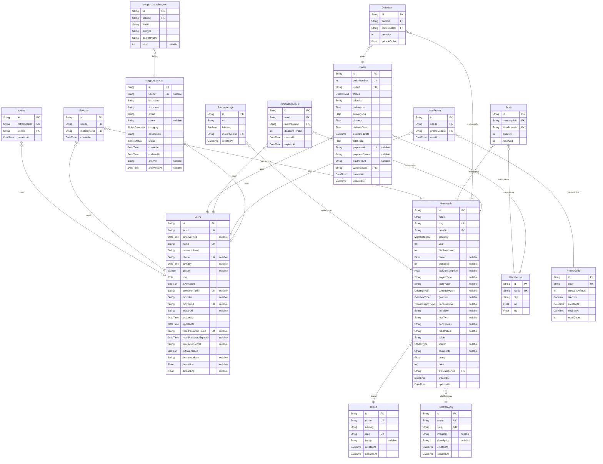

# Prisma Markdown

## Structure

### `users`

Properties as follows:

- `id`:
- `email`:
- `emailVerified`:
- `name`:
- `passwordHash`:
- `phone`:
- `birthday`:
- `gender`:
- `role`:
- `isActivated`:
- `activationToken`:
- `provider`:
- `providerId`:
- `avatarUrl`:
- `createdAt`:
- `updatedAt`:
- `resetPasswordToken`:
- `resetPasswordExpires`:
- `twoFactorSecret`:
- `is2FAEnabled`:
- `defaultAddress`:
- `defaultLat`:
- `defaultLng`:

### `tokens`

Properties as follows:

- `id`:
- `refreshToken`:
- `userId`:
- `createdAt`:

### `Brand`

Properties as follows:

- `id`:
- `name`:
- `country`:
- `slug`:
- `image`:
- `createdAt`:
- `updatedAt`:

### `Motorcycle`

Properties as follows:

- `id`:
- `model`:
- `slug`:
- `brandId`:
- `category`:
- `year`:
- `displacement`:
- `power`:
- `topSpeed`:
- `fuelConsumption`:
- `engineType`:
- `fuelSystem`:
- `coolingSystem`:
- `gearbox`:
- `transmission`:
- `frontTyre`:
- `rearTyre`:
- `frontBrakes`:
- `rearBrakes`:
- `colors`:
- `starter`:
- `comments`:
- `rating`:
- `price`:
- `siteCategoryId`:
- `createdAt`:
- `updatedAt`:

### `SiteCategory`

Properties as follows:

- `id`:
- `name`:
- `slug`:
- `imageUrl`:
- `description`:
- `createdAt`:
- `updatedAt`:

### `ProductImage`

Properties as follows:

- `id`:
- `url`:
- `isMain`:
- `motorcycleId`:
- `createdAt`:

### `Favorite`

Properties as follows:

- `id`:
- `userId`:
- `motorcycleId`:
- `createdAt`:

### `Warehouse`

Properties as follows:

- `id`:
- `name`:
- `city`:
- `lat`:
- `lng`:

### `Stock`

Properties as follows:

- `id`:
- `motorcycleId`:
- `warehouseId`:
- `quantity`:
- `reserved`:

### `Order`

Properties as follows:

- `id`:
- `orderNumber`:
- `userId`:
- `status`:
- `address`:
- `deliveryLat`:
- `deliveryLng`:
- `distance`:
- `deliveryCost`:
- `estimatedDate`:
- `totalPrice`:
- `paymentId`:
- `paymentStatus`:
- `paymentUrl`:
- `warehouseId`:
- `createdAt`:
- `updatedAt`:

### `OrderItem`

Properties as follows:

- `id`:
- `orderId`:
- `motorcycleId`:
- `quantity`:
- `priceAtOrder`:

### `PersonalDiscount`

Properties as follows:

- `id`:
- `userId`:
- `motorcycleId`:
- `discountPercent`:
- `createdAt`:
- `expiresAt`:

### `PromoCode`

Properties as follows:

- `id`:
- `code`:
- `discountAmount`:
- `isActive`:
- `createdAt`:
- `expiresAt`:
- `usedCount`:

### `UsedPromo`

Properties as follows:

- `id`:
- `userId`:
- `promoCodeId`:
- `usedAt`:

### `support_tickets`

Properties as follows:

- `id`:
- `userId`:
- `lastName`:
- `firstName`:
- `email`:
- `phone`:
- `category`:
- `description`:
- `status`:
- `createdAt`:
- `updatedAt`:
- `answer`:
- `answeredAt`:

### `support_attachments`

Properties as follows:

- `id`:
- `ticketId`:
- `fileUrl`:
- `fileType`:
- `originalName`:
- `size`:
